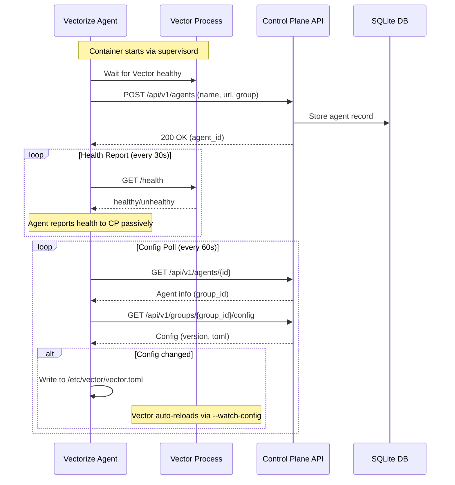
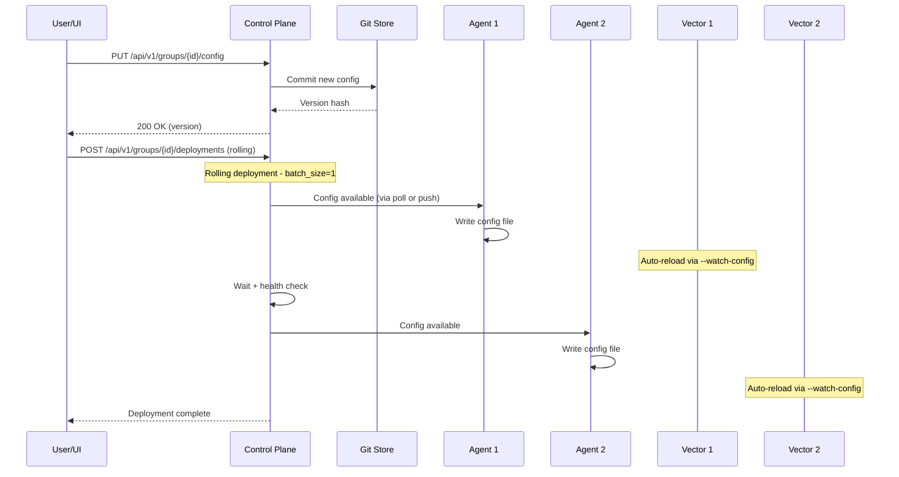
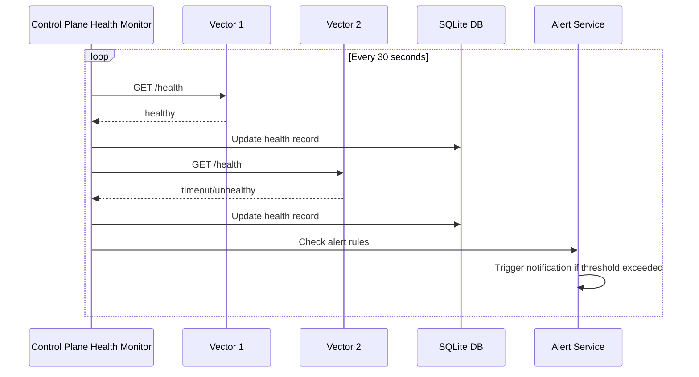

# Vectorize Architecture - Complete Solution Context

**Last Updated:** February 3, 2026

This document provides a complete understanding of the Vectorize solution architecture. **Read this before making any changes.**

---

## Table of Contents

1. [What is Vectorize?](#what-is-vectorize)
2. [Solution Overview](#solution-overview)
3. [Deployment Modes](#deployment-modes)
4. [Multi-Agent Architecture](#multi-agent-architecture)
5. [Communication Flows](#communication-flows)
6. [Component Inventory](#component-inventory)
7. [API Reference](#api-reference)
8. [File Map](#file-map)
9. [Environment Variables](#environment-variables)
10. [Build & Run](#build--run)
11. [Troubleshooting](#troubleshooting)

---

## What is Vectorize?

**Vectorize** is a visual control plane for [Vector](https://vector.dev) - the high-performance observability data pipeline from Datadog/Timber.

### The Problem

Managing Vector configurations across multiple servers is hard:
- Edit TOML files manually on each server
- SSH into each server to deploy changes
- No version history or rollback capability
- No visibility across your Vector fleet
- Hope configs are valid before deploying

### The Solution

Vectorize provides:
- **Visual drag-and-drop pipeline builder** - No TOML required
- **One-click deployment to all agents** - Rolling, canary, or basic strategies
- **Git-backed config versioning** - Full history with rollback
- **Unified dashboard** - Monitor all Vector instances from one UI
- **4-layer validation** - Syntax, schema, Vector, and functional testing

---

## Solution Overview

Vectorize is a **single Rust binary** that operates in two modes:

```
┌─────────────────────────────────────────────────────────────────────────┐
│                        VECTORIZE BINARY                                  │
│                                                                          │
│   ┌────────────────────────────┐    ┌────────────────────────────┐     │
│   │     SERVER MODE            │    │      AGENT MODE            │     │
│   │     (Control Plane)        │    │      (Sidecar)             │     │
│   │                            │    │                            │     │
│   │  • Web UI (Leptos/WASM)    │    │  • Registers with CP       │     │
│   │  • REST API (Axum)         │    │  • Polls for config        │     │
│   │  • SQLite database         │    │  • Reports health          │     │
│   │  • Git config store        │    │  • Writes config to disk   │     │
│   │  • Health monitor          │    │  • ~10MB memory            │     │
│   │  • Deployment engine       │    │                            │     │
│   └────────────────────────────┘    └────────────────────────────┘     │
└─────────────────────────────────────────────────────────────────────────┘
```

---

## Deployment Modes

### Single-Node Mode (Default)

For development or single-server deployments. Vectorize runs Vector as a subprocess:

```bash
./vectorize --config /path/to/vector.toml
```

```
┌─────────────────────────────────────────────┐
│                 Vectorize                    │
│  ┌─────────────┐      ┌─────────────────┐   │
│  │  Web UI     │      │  Vector Process │   │
│  │  :8080      │ ──── │  :8686          │   │
│  └─────────────┘      └─────────────────┘   │
│  ┌─────────────┐      ┌─────────────────┐   │
│  │  SQLite     │      │  Git Store      │   │
│  └─────────────┘      └─────────────────┘   │
└─────────────────────────────────────────────┘
```

### Multi-Agent Mode

For managing fleets of Vector instances. The control plane runs centrally, agents run as sidecars alongside each Vector instance:

```bash
# Control Plane (central server)
./vectorize --port 8080

# Agents (on each Vector host)
./vectorize agent --control-plane http://control-plane:8080 --name prod-1
```

---

## Multi-Agent Architecture

### Full System Diagram

```mermaid
flowchart TB
    subgraph ControlPlane [Vectorize Control Plane - localhost:8080]
        UI[Leptos WebUI - WASM]
        API[REST API - Axum]
        GitStore[Git Config Store]
        SQLite[(SQLite DB)]
        Health[Health Monitor]
        Deploy[Deployment Engine]
        
        UI --> API
        API --> GitStore
        API --> SQLite
        API --> Health
        API --> Deploy
    end
    
    subgraph ProductionGroup [Production Worker Group]
        subgraph Container1 [Docker Container - vector-prod-1]
            Vector1[Vector Binary :8686]
            Agent1[Vectorize Agent Sidecar]
            Supervisor1[Supervisord]
            Supervisor1 --> Vector1
            Supervisor1 --> Agent1
        end
        
        subgraph Container2 [Docker Container - vector-prod-2]
            Vector2[Vector Binary :8686]
            Agent2[Vectorize Agent Sidecar]
            Supervisor2[Supervisord]
            Supervisor2 --> Vector2
            Supervisor2 --> Agent2
        end
        
        subgraph Container3 [Docker Container - vector-prod-3]
            Vector3[Vector Binary :8686]
            Agent3[Vectorize Agent Sidecar]
            Supervisor3[Supervisord]
            Supervisor3 --> Vector3
            Supervisor3 --> Agent3
        end
    end
    
    subgraph StagingGroup [Staging Worker Group]
        subgraph Container4 [Docker Container - vector-staging-1]
            Vector4[Vector Binary :8686]
            Agent4[Vectorize Agent Sidecar]
            Supervisor4[Supervisord]
            Supervisor4 --> Vector4
            Supervisor4 --> Agent4
        end
        
        subgraph Container5 [Docker Container - vector-staging-2]
            Vector5[Vector Binary :8686]
            Agent5[Vectorize Agent Sidecar]
            Supervisor5[Supervisord]
            Supervisor5 --> Vector5
            Supervisor5 --> Agent5
        end
    end
    
    Agent1 -->|Register + Health + Poll Config| API
    Agent2 -->|Register + Health + Poll Config| API
    Agent3 -->|Register + Health + Poll Config| API
    Agent4 -->|Register + Health + Poll Config| API
    Agent5 -->|Register + Health + Poll Config| API
    
    Health -->|Poll /health| Vector1
    Health -->|Poll /health| Vector2
    Health -->|Poll /health| Vector3
    Health -->|Poll /health| Vector4
    Health -->|Poll /health| Vector5
```



### Key Concepts

| Concept | Description |
|---------|-------------|
| **Control Plane** | Central Vectorize server running the UI, API, database, and deployment engine |
| **Vectorize Agent** | Lightweight sidecar (~10MB) that runs alongside each Vector instance |
| **Worker Group** | Logical grouping of agents (e.g., "production", "staging") sharing the same config |
| **Vector** | The actual data pipeline binary from Datadog that processes observability data |
| **Supervisord** | Process manager in Docker containers that runs both Vector and the agent |

### Inside Each Docker Container

```
┌────────────────────────────────────────────────────────────┐
│  Docker Container                                           │
│                                                             │
│  ┌─────────────────────────────────────────────────────┐   │
│  │  Supervisord (PID 1)                                 │   │
│  │    │                                                 │   │
│  │    ├── Vector Process                               │   │
│  │    │     • Runs with --watch-config                 │   │
│  │    │     • Exposes GraphQL API on :8686             │   │
│  │    │     • Auto-reloads when config file changes    │   │
│  │    │                                                │   │
│  │    └── Vectorize Agent Process                      │   │
│  │          • Registers with control plane             │   │
│  │          • Polls for config updates (every 60s)     │   │
│  │          • Writes config to /etc/vector/vector.toml │   │
│  │          • Reports health status                    │   │
│  └─────────────────────────────────────────────────────┘   │
│                                                             │
│  /etc/vector/vector.toml  ← Config file (shared volume)    │
└────────────────────────────────────────────────────────────┘
```

---

## Communication Flows

### 1. Agent Registration Flow

When a container starts, the agent registers with the control plane:



### 2. Config Deployment Flow

When a user deploys a new configuration:



### 3. Health Monitoring Flow

The control plane actively monitors all agents:



---

## Component Inventory

### Backend Components (vectorize-cli/)

| Component | Location | Description | Status |
|-----------|----------|-------------|--------|
| CLI Entry | `src/main.rs` | Entry point, starts server or agent mode | Complete |
| HTTP Server | `src/server.rs` | Axum server setup, routes, middleware | Complete |
| Agent Sidecar | `src/agent/mod.rs` | Registration, config polling, health | Complete |
| Vector Manager | `src/vector_manager.rs` | Starts/manages Vector subprocess | Complete |
| **API Layer** | `src/api/` | REST API endpoints | Complete |
| - Agents | `src/api/agents.rs` | Agent CRUD operations | Complete |
| - Groups | `src/api/groups.rs` | Worker group management | Complete |
| - Deployments | `src/api/deployments.rs` | Deployment orchestration | Complete |
| - Health | `src/api/health.rs` | Health checks and metrics | Complete |
| - Auth | `src/api/auth.rs` | JWT authentication, setup | Complete |
| - Users | `src/api/users.rs` | User management | Complete |
| - Roles | `src/api/roles.rs` | RBAC role management | Complete |
| - Alerts | `src/api/alerts.rs` | Alert rules and channels | Complete |
| - Audit | `src/api/audit.rs` | Audit logging | Complete |
| - Git | `src/api/git.rs` | Remote Git sync | Complete |
| - Tap | `src/api/tap.rs` | Live data sampling | Complete |
| - Validation | `src/api/validation.rs` | Config validation | Complete |
| **Core Services** | | | |
| Git Store | `src/git_store/` | Git-based config versioning | Complete |
| Deployment | `src/deployment/mod.rs` | Rolling/canary deployments | Complete |
| Health Monitor | `src/health/mod.rs` | Background health checking | Complete |
| RBAC | `src/rbac/mod.rs` | Permission enforcement | Complete |
| SSO | `src/sso/mod.rs` | OIDC/SAML integration | Complete |
| Alerts | `src/alerts/mod.rs` | Alert rule evaluation | Complete |
| Tap Service | `src/tap/mod.rs` | Rate-limited data sampling | Complete |
| Validation | `src/validation/` | 4-layer config validation | Complete |
| **Database** | `src/db/` | SQLite storage | Complete |
| - Models | `src/db/models.rs` | Data models | Complete |
| - Repository | `src/db/repository.rs` | Database operations | Complete |
| - Migrations | `src/db/migrations.rs` | Schema migrations | Complete |

### Frontend Components (ui/)

| Component | Location | Description | Status |
|-----------|----------|-------------|--------|
| App Root | `src/app.rs` | Root component, routing | Complete |
| State | `src/state/mod.rs` | Global state management | Complete |
| **Layout** | `src/components/layout/` | | Complete |
| - AppShell | `app_shell.rs` | Main layout container | Complete |
| - Sidebar | `sidebar.rs` | Navigation sidebar | Complete |
| - TopBar | `top_bar.rs` | Contextual top bar | Complete |
| - BottomPanel | `bottom_panel.rs` | Resizable data panel | Complete |
| - StatusBar | `status_bar.rs` | Connection status | Complete |
| **Pipeline** | `src/components/pipeline/` | | Complete |
| - Canvas | `canvas.rs` | Drag-and-drop canvas | Complete |
| - Node | `node.rs` | Pipeline node component | Complete |
| - Palette | `palette.rs` | Component palette | Complete |
| - ConfigPanel | `config_panel.rs` | Node configuration | Complete |
| - DataView | `data_view.rs` | Live data preview | Complete |
| **Fleet** | `src/components/fleet/` | | Complete |
| - AgentsList | `agents_list.rs` | Agent table view | Complete |
| - AgentDetail | `agent_detail.rs` | Agent detail view | Complete |
| **Management** | `src/components/management/` | | Complete |
| - Groups | `groups.rs` | Worker group management | Complete |
| **Observe** | `src/components/observe/` | | Complete |
| - Metrics | `metrics.rs` | Metrics dashboard | Complete |
| - Alerts | `alerts.rs` | Alert management | Complete |
| - Audit | `audit.rs` | Audit log viewer | Complete |
| **Settings** | `src/components/settings/` | | Complete |
| - Users | `users.rs` | User management | Complete |
| - Roles | `roles.rs` | Role management | Complete |
| - ApiKeys | `api_keys.rs` | API key management | Complete |
| - SSO | `sso.rs` | SSO configuration | Complete |
| - Git | `git.rs` | Git remote sync | Complete |
| - System | `system.rs` | System settings | Complete |
| **Client** | `src/client/` | | Complete |
| - Direct | `direct.rs` | Vector GraphQL client | Complete |
| - Subscription | `subscription.rs` | WebSocket subscriptions | Complete |

### Docker Setup (dev/)

| File | Description | Status |
|------|-------------|--------|
| `docker-compose.yml` | Multi-agent development environment | Complete |
| `Dockerfile.agent` | Combined Vector + Vectorize Agent image | Complete |
| `supervisord.conf` | Process management configuration | Complete |
| `configs/production/vector.toml` | Production group config | Complete |
| `configs/staging/vector.toml` | Staging group config | Complete |
| `scripts/start-dev.sh` | Start development environment | Complete |
| `scripts/stop-dev.sh` | Stop development environment | Complete |

---

## API Reference

### Authentication

| Endpoint | Method | Description |
|----------|--------|-------------|
| `/api/v1/setup/status` | GET | Check if setup is needed |
| `/api/v1/setup/init` | POST | Create admin account |
| `/api/v1/auth/login` | POST | Login, returns JWT |
| `/api/v1/auth/logout` | POST | Invalidate session |
| `/api/v1/auth/me` | GET | Get current user |

### Agents

| Endpoint | Method | Description |
|----------|--------|-------------|
| `/api/v1/agents` | GET | List all agents |
| `/api/v1/agents` | POST | Register new agent |
| `/api/v1/agents/:id` | GET | Get agent details |
| `/api/v1/agents/:id` | PUT | Update agent |
| `/api/v1/agents/:id` | DELETE | Remove agent |

### Worker Groups

| Endpoint | Method | Description |
|----------|--------|-------------|
| `/api/v1/groups` | GET | List all groups |
| `/api/v1/groups` | POST | Create group |
| `/api/v1/groups/:id` | GET | Get group details |
| `/api/v1/groups/:id` | PUT | Update group |
| `/api/v1/groups/:id` | DELETE | Delete group |
| `/api/v1/groups/:id/agents` | GET | List agents in group |
| `/api/v1/groups/:id/config` | GET | Get current config |
| `/api/v1/groups/:id/config` | PUT | Update config |
| `/api/v1/groups/:id/history` | GET | Get config history |
| `/api/v1/groups/:id/rollback` | POST | Rollback to version |
| `/api/v1/groups/:id/diff` | GET | Get config diff |

### Deployments

| Endpoint | Method | Description |
|----------|--------|-------------|
| `/api/v1/groups/:id/deployments` | GET | List deployments |
| `/api/v1/groups/:id/deployments` | POST | Create deployment |
| `/api/v1/deployments/:id` | GET | Get deployment status |
| `/api/v1/deployments/:id/approve` | POST | Approve deployment |
| `/api/v1/deployments/:id/reject` | POST | Reject deployment |
| `/api/v1/deployments/:id/cancel` | POST | Cancel deployment |

### Health & Monitoring

| Endpoint | Method | Description |
|----------|--------|-------------|
| `/api/v1/health/agents` | GET | Health check all agents |
| `/api/v1/health/agents/:id/history` | GET | Agent health history |
| `/api/v1/metrics` | GET | Aggregated metrics |
| `/api/v1/topology` | GET | Aggregated topology |

### Validation & Testing

| Endpoint | Method | Description |
|----------|--------|-------------|
| `/api/v1/validate/quick` | POST | Syntax validation only |
| `/api/v1/validate` | POST | Full validation |
| `/api/v1/test` | POST | Start functional test |
| `/api/v1/test/:id` | GET | Get test results |

### Alerts

| Endpoint | Method | Description |
|----------|--------|-------------|
| `/api/v1/alerts/rules` | GET | List alert rules |
| `/api/v1/alerts/rules` | POST | Create alert rule |
| `/api/v1/alerts/channels` | GET | List notification channels |
| `/api/v1/alerts/channels` | POST | Create channel |
| `/api/v1/alerts/channels/:id/test` | POST | Test channel |

### Users & Roles

| Endpoint | Method | Description |
|----------|--------|-------------|
| `/api/v1/users` | GET | List users |
| `/api/v1/users` | POST | Create user |
| `/api/v1/users/:id` | PUT | Update user |
| `/api/v1/users/:id` | DELETE | Delete user |
| `/api/v1/roles` | GET | List roles |
| `/api/v1/roles/permissions` | GET | List all permissions |
| `/api/v1/roles` | POST | Create role |

### Audit

| Endpoint | Method | Description |
|----------|--------|-------------|
| `/api/v1/audit` | GET | Query audit logs |
| `/api/v1/audit/actions` | GET | List audit actions |

### Live Data Sampling

| Endpoint | Method | Description |
|----------|--------|-------------|
| `/api/v1/tap/config` | GET | Get tap configuration |
| `/api/v1/tap/:agent_id/sample` | GET | Sample events |
| `/api/v1/tap/:agent_id/rate-limit` | GET | Check rate limit |
| `/api/v1/tap/:agent_id/ws-info` | GET | WebSocket info |

### Git Sync

| Endpoint | Method | Description |
|----------|--------|-------------|
| `/api/v1/git/remotes` | GET | List remotes |
| `/api/v1/git/remotes` | POST | Add remote |
| `/api/v1/git/remotes/:name` | DELETE | Remove remote |
| `/api/v1/git/remotes/:name/push` | POST | Push to remote |
| `/api/v1/git/remotes/:name/pull` | POST | Pull from remote |
| `/api/v1/git/remotes/:name/sync` | POST | Sync with remote |
| `/api/v1/git/branches` | GET | List branches |

---

## File Map

### Critical Backend Files

```
vectorize-cli/src/
├── main.rs                 # CLI entry point - parses args, starts server or agent
├── server.rs               # Axum HTTP server setup with all routes
├── lib.rs                  # Library exports
├── agent/
│   └── mod.rs              # Agent sidecar - registration, polling, health
├── vector_manager.rs       # Manages Vector subprocess in single-node mode
├── api/
│   ├── mod.rs              # API module exports
│   ├── agents.rs           # POST/GET/PUT/DELETE /agents
│   ├── groups.rs           # Worker group CRUD + config management
│   ├── deployments.rs      # Deployment creation and orchestration
│   ├── health.rs           # Health endpoints
│   ├── auth.rs             # JWT login, setup wizard
│   ├── users.rs            # User CRUD
│   ├── roles.rs            # Role/permission management
│   ├── alerts.rs           # Alert rules and channels
│   ├── audit.rs            # Audit log queries
│   ├── git.rs              # Remote Git sync
│   ├── tap.rs              # Live data sampling
│   └── validation.rs       # Config validation
├── db/
│   ├── mod.rs              # Database module
│   ├── models.rs           # Agent, Group, User, Role, etc.
│   ├── repository.rs       # CRUD operations
│   └── migrations.rs       # Schema migrations
├── git_store/
│   ├── mod.rs              # Git-based config versioning
│   └── repository.rs       # Git operations
├── deployment/
│   └── mod.rs              # Rolling/canary deployment strategies
├── health/
│   └── mod.rs              # Background health monitoring
├── rbac/
│   └── mod.rs              # Permission checking middleware
├── sso/
│   └── mod.rs              # OIDC/SAML integration
├── alerts/
│   └── mod.rs              # Alert evaluation and notifications
├── tap/
│   └── mod.rs              # Rate-limited data sampling
└── validation/
    ├── mod.rs              # Validation orchestration
    └── functional_test.rs  # Layer 4 functional testing
```

### Critical Frontend Files

```
ui/src/
├── main.rs                 # WASM entry point
├── lib.rs                  # Library exports
├── app.rs                  # Root component, Router, Routes
├── state/
│   └── mod.rs              # AppState with RwSignals, theme, sidebar state
├── client/
│   ├── mod.rs              # Client exports
│   ├── direct.rs           # HTTP GraphQL client for Vector API
│   ├── subscription.rs     # WebSocket subscription client
│   └── types.rs            # Client types
└── components/
    ├── mod.rs              # Component exports
    ├── layout/             # AppShell, Sidebar, TopBar, BottomPanel, StatusBar
    ├── pipeline/           # Canvas, Node, Palette, ConfigPanel, DataView
    ├── fleet/              # AgentsList, AgentDetail, Topology
    ├── management/         # Groups, History
    ├── observe/            # Metrics, Alerts, Audit
    └── settings/           # Users, Roles, ApiKeys, SSO, Git, System
```

### Docker Setup Files

```
dev/
├── docker-compose.yml      # 5 containers: 3 prod + 2 staging agents
├── Dockerfile.agent        # Multi-stage: Vector + Vectorize agent + supervisord
├── supervisord.conf        # Runs Vector (--watch-config) + Vectorize agent
├── configs/
│   ├── production/
│   │   └── vector.toml     # Config for production group
│   └── staging/
│       └── vector.toml     # Config for staging group
└── scripts/
    ├── start-dev.sh        # Builds and starts Docker environment
    └── stop-dev.sh         # Stops all containers
```

---

## Environment Variables

### Control Plane (Server Mode)

| Variable | Description | Default |
|----------|-------------|---------|
| `VECTORIZE_PORT` | HTTP server port | `8080` |
| `VECTORIZE_DB_PATH` | SQLite database path | `./vectorize.db` |
| `VECTORIZE_GIT_PATH` | Git store path | `./config-store` |
| `JWT_SECRET` | JWT signing secret | (generated) |

### Agent Mode

| Variable | Description | Default |
|----------|-------------|---------|
| `VECTORIZE_CONTROL_PLANE` | Control plane URL | `http://localhost:8080` |
| `VECTORIZE_AGENT_NAME` | Agent name | hostname |
| `VECTORIZE_GROUP` | Worker group to join | (none) |
| `VECTORIZE_API_KEY` | API key for auth | (none) |
| `VECTOR_API_URL` | Local Vector API URL | `http://localhost:8686` |
| `VECTOR_CONFIG_PATH` | Vector config file path | `/etc/vector/vector.toml` |

### Vector Process

| Variable | Description | Default |
|----------|-------------|---------|
| `VECTOR_API_ENABLED` | Enable Vector GraphQL API | `true` |
| `VECTOR_API_ADDRESS` | Vector API bind address | `0.0.0.0:8686` |
| `VECTOR_LOG` | Log level | `info` |

---

## Build & Run

### Prerequisites

- Rust 1.70+
- Node.js 18+ (for TailwindCSS)
- [Trunk](https://trunkrs.dev/) for WASM builds
- Docker (for multi-agent testing)

### Build Order

**CRITICAL**: UI must be built BEFORE the CLI (CLI embeds UI assets).

```bash
# 1. Build UI (WASM)
cd ui
npm install                              # First time only
npx tailwindcss -i input.css -o output.css
trunk build --release
cd ..

# 2. Build CLI (embeds UI)
cargo build --release -p vectorize

# 3. Run single-node mode
./target/release/vectorize --config config/demo.toml
```

### Run Multi-Agent Docker Environment

```bash
# Start all agents (requires Docker)
./dev/scripts/start-dev.sh

# Stop all agents
./dev/scripts/stop-dev.sh
```

### Development Mode

```bash
# Terminal 1: Run UI with hot reload
cd ui && trunk serve --open

# Terminal 2: Run Vector separately
./target/release/vector --config config/demo.toml
```

---

## Troubleshooting

### UI Changes Not Appearing

**Cause**: Didn't rebuild CLI after UI changes (UI is embedded in CLI binary).

**Fix**:
```bash
cd ui && trunk build --release
cd ../vectorize-cli && cargo build --release
# Restart server and hard refresh browser (Cmd+Shift+R)
```

### Agent Not Registering

**Cause**: Control plane not reachable from container.

**Fix**: 
- Ensure control plane is running on host
- Check `VECTORIZE_CONTROL_PLANE` uses `host.docker.internal` (not `localhost`)
- Verify `extra_hosts` in docker-compose.yml

### Config Not Updating on Agents

**Cause**: Agent polling interval or config version mismatch.

**Fix**:
- Check agent logs for config poll errors
- Verify group config was saved: `GET /api/v1/groups/{id}/config`
- Manually trigger agent config check

### Docker Build Fails

**Cause**: Rust compilation in Docker takes resources.

**Fix**:
- Increase Docker memory/CPU limits
- Use `CARGO_INCREMENTAL=0` for smaller builds
- Check for OpenSSL static linking issues

### WebSocket Subscription Fails

**Cause**: CORS or WebSocket protocol mismatch.

**Fix**:
- Ensure Vector API is enabled
- Check URL uses `ws://` not `http://`
- Verify graphql-ws protocol is used (not subscriptions-transport-ws)

### Port Already in Use

```bash
# Kill existing processes
pkill -f vectorize
pkill -f "vector.*8686"
```

---

## Quick Reference

### Ports

| Service | Port |
|---------|------|
| Vectorize UI | 8080 |
| Vector API (local) | 8686 |
| Vector API (prod-1) | 8686 |
| Vector API (prod-2) | 8687 |
| Vector API (prod-3) | 8688 |
| Vector API (staging-1) | 8689 |
| Vector API (staging-2) | 8690 |

### Test Commands

```bash
# Check Vectorize health
curl http://localhost:8080/api/v1/health

# Check Vector health
curl http://localhost:8686/health

# List agents
curl http://localhost:8080/api/v1/agents

# List groups
curl http://localhost:8080/api/v1/groups
```

### CLI Commands

```bash
# Server mode
./vectorize --config config/demo.toml
./vectorize --port 8080 --no-browser

# Agent mode
./vectorize agent --control-plane http://cp:8080 --name my-agent

# CLI commands
./vectorize agents list
./vectorize groups list
./vectorize config validate my.toml
./vectorize deploy create production --strategy rolling
```

---

## Summary

Vectorize is a complete fleet management solution for Vector:

1. **Control Plane** - Central server with UI, API, database, Git store
2. **Vectorize Agent** - Lightweight sidecar that runs alongside each Vector instance
3. **Worker Groups** - Logical groupings of agents sharing the same configuration
4. **Communication** - Agents register with CP, poll for config updates, report health
5. **Deployment** - Rolling/canary strategies with approval workflows
6. **Everything is built** - All components are implemented and ready for use

The Docker development environment (`dev/`) provides a complete multi-agent setup with 3 production and 2 staging agents, each running Vector + Vectorize Agent managed by supervisord.
