# Vectorize UI/UX Complete Overhaul

## Design Philosophy

- **Engineer-focused**: Fast, keyboard-friendly, power-user features
- **Fleet-first**: Multi-agent management is the primary use case
- **Visual + Code**: Toggle between forms and TOML for configuration
- **Flexible layouts**: Resizable panels like VS Code/browser dev tools
- **References**: n8n (node canvas), Cribl (pipeline management), VS Code (layout/panels)

## Information Architecture

```mermaid
graph TD
    subgraph nav [Main Navigation]
        Fleets[Fleets]
        Pipelines[Pipelines]
        Observe[Observability]
        Settings[Settings]
    end
    
    subgraph fleets [Fleets Section]
        Groups[Worker Groups]
        Agents[Agents]
        Topology[Topology View]
        Deployments[Deployments]
    end
    
    subgraph pipelines [Pipelines Section]
        Builder[Pipeline Builder]
        Library[Pipeline Library]
        Templates[Templates]
        Testing[Functional Testing]
    end
    
    subgraph observe [Observability Section]
        DataExplorer[Data Explorer]
        Metrics[Metrics]
        Alerts[Alerts]
        Audit[Audit Logs]
    end
    
    subgraph settings [Settings Section]
        Users[Users]
        Roles[Roles]
        APIKeys[API Keys]
        SSO[SSO Config]
        Git[Git Remotes]
        System[System]
    end
    
    Fleets --> Groups
    Fleets --> Agents
    Fleets --> Topology
    Fleets --> Deployments
    
    Pipelines --> Builder
    Pipelines --> Library
    Pipelines --> Templates
    Pipelines --> Testing
    
    Observe --> DataExplorer
    Observe --> Metrics
    Observe --> Alerts
    Observe --> Audit
    
    Settings --> Users
    Settings --> Roles
    Settings --> APIKeys
    Settings --> SSO
    Settings --> Git
    Settings --> System
```




## Layout System

### Global Layout Structure

```
+----------------------------------------------------------+
|  [Logo]  Contextual Top Bar (breadcrumbs, actions)  [User]|
+--------+-------------------------------------------------+
|        |                                                  |
| Side   |              Main Content Area                   |
| bar    |                                                  |
| (56px) |                                                  |
|        +-------------------------------------------------+
|        |        Resizable Bottom Panel (Data/Logs)       |
+--------+-------------------------------------------------+
|                    Status Bar                             |
+----------------------------------------------------------+
```

### Sidebar (Activity Bar Style)

- **Fixed width**: 56px collapsed (icons only), 240px expanded
- **Sections**:
  - Fleets (grid icon)
  - Pipelines (workflow icon)
  - Observability (chart icon)
  - Settings (gear icon)
- **Bottom**: User avatar, theme toggle, collapse button
- **Behavior**: Click to navigate, hover to see tooltip, double-click to expand/collapse

### Contextual Top Bar

- **Left**: Breadcrumb navigation (e.g., "Fleets > production > Pipeline")
- **Center**: Context-specific tabs (when applicable)
- **Right**: Primary actions for current view, notifications, user menu

### Resizable Bottom Panel

- **Default height**: 256px (collapsible to 0)
- **Drag handle**: Visible resize bar
- **Tabs**: Data Preview | Logs | Test Results | Notifications
- **Persist state**: Remember panel height and selected tab

---

## Phase 1: Core Layout and Navigation

### 1.1 New Layout Components

Create flexible layout primitives:

- `AppShell` - Main layout container with sidebar, top bar, content, bottom panel
- `Sidebar` - Collapsible icon/text navigation with sections
- `TopBar` - Contextual breadcrumbs, tabs, and actions
- `BottomPanel` - Resizable panel with tabs
- `StatusBar` - Connection status, quick stats

**Files to create/modify**:

- [ui/src/components/layout/mod.rs](ui/src/components/layout/mod.rs) (new)
- [ui/src/components/layout/app_shell.rs](ui/src/components/layout/app_shell.rs) (new)
- [ui/src/components/layout/sidebar.rs](ui/src/components/layout/sidebar.rs) (new)
- [ui/src/components/layout/top_bar.rs](ui/src/components/layout/top_bar.rs) (new)
- [ui/src/components/layout/bottom_panel.rs](ui/src/components/layout/bottom_panel.rs) (new)
- [ui/src/components/layout/status_bar.rs](ui/src/components/layout/status_bar.rs) (new)

### 1.2 Theme System

Implement light/dark mode support:

- CSS variables for all colors
- Theme context provider
- Persist preference in localStorage
- System preference detection

**Files to modify**:

- [ui/tailwind.config.js](ui/tailwind.config.js) - Add CSS variable-based colors
- [ui/input.css](ui/input.css) - Define light/dark CSS variables
- [ui/src/state/mod.rs](ui/src/state/mod.rs) - Add theme signal

### 1.3 Routing Restructure

Reorganize routes to match new IA:

```
/                           -> Dashboard (fleet overview)
/fleets                     -> Worker Groups list
/fleets/:group_id           -> Group detail (agents, config, deployments)
/fleets/:group_id/pipeline  -> Pipeline builder for group
/fleets/:group_id/history   -> Config history
/pipelines                  -> Pipeline library
/pipelines/new              -> New pipeline (standalone)
/pipelines/:id              -> Edit pipeline
/observe                    -> Data explorer
/observe/metrics            -> Metrics dashboard
/observe/alerts             -> Alert rules
/observe/audit              -> Audit logs
/settings                   -> User profile
/settings/users             -> User management
/settings/roles             -> Role management
/settings/api-keys          -> API key management
/settings/sso               -> SSO configuration
/settings/git               -> Git remote sync
/settings/system            -> System settings
/setup                      -> First-time setup wizard
```

---

## Phase 2: Fleet Management

### 2.1 Worker Groups List

Primary fleet view organized by groups:

- Card-based layout showing each group
- Health indicator (healthy/degraded/critical)
- Agent count, current config version
- Quick actions: View, Deploy, Edit
- Filter/search by name, status

### 2.2 Group Detail View

Tabbed interface for each group:

- **Overview**: Health summary, recent activity, quick stats
- **Agents**: Table of agents with status, version, latency
- **Pipeline**: Embedded pipeline builder
- **Config**: Current config with history sidebar
- **Deployments**: Deployment history, create new deployment
- **Settings**: Group settings, approval workflow

### 2.3 Agent Management

Table view with:

- Status indicators (healthy/unhealthy/unreachable)
- Vector version
- Last seen timestamp
- Health history sparkline
- Actions: View details, Remove from group

### 2.4 Topology View

Visual representation of data flow:

- Aggregate view of all pipelines across groups
- Clickable nodes to drill into details
- Live data flow animation (optional)

---

## Phase 3: Pipeline Builder Redesign

### 3.1 Canvas Overhaul (n8n-style)

Complete redesign of the pipeline canvas:

- **Grid background**: Subtle dot grid for alignment
- **Zoom controls**: Fit to view, zoom in/out, zoom percentage
- **Minimap**: Small overview in corner (toggleable)
- **Pan/zoom**: Mouse wheel zoom, drag to pan, trackpad gestures
- **Selection**: Click to select, Shift+click multi-select, drag box select

### 3.2 Node Design

Redesigned nodes with more information:

```
+------------------------------------------+
|  [Icon]  Source: demo_logs       [Menu]  |
+------------------------------------------+
|  interval: 1s                            |
|  format: shuffle                         |
+------------------------------------------+
|  Events: 1,234/s                [Status] |
+------------------------------------------+
         |
         v (output port)
```

- **Header**: Icon, type badge, name, overflow menu
- **Body**: Key config values (expandable)
- **Footer**: Live metrics, status indicator
- **Ports**: Visual input/output connection points

### 3.3 Connection Lines

Improved connection visualization:

- Bezier curves (smoother than current)
- Animated flow direction (optional)
- Highlight on hover
- Delete on click (with confirmation)
- Drag from port to port to create

### 3.4 Component Palette

Redesigned sidebar:

- Search/filter box at top
- Collapsible sections: Sources, Transforms, Sinks
- Drag to canvas to add
- Click to see description/docs
- Recently used section

### 3.5 Config Panel

Right sidebar for selected node:

- **Header**: Node name (editable), type, delete button
- **Tabs**: Form | TOML | Docs
- **Form view**: Structured inputs with validation
- **TOML view**: Code editor with syntax highlighting
- **Docs view**: Inline documentation from Vector
- **Apply button**: Deploy changes

---

## Phase 4: Data Explorer

### 4.1 Bottom Panel Implementation

Resizable panel for data viewing:

- Drag handle at top edge
- Collapse/expand button
- Tab bar: Data Preview | Logs | Test Results

### 4.2 Data Preview Tab

Live event streaming:

- **Filter bar**: Component filter, search, pause/resume
- **View modes**: Table | JSON | Raw
- **Table view**: Parsed fields as columns, sortable
- **JSON view**: Pretty-printed with syntax highlighting
- **Virtual scrolling**: Handle high event volumes

### 4.3 Test Results Tab

Functional testing interface:

- Input events editor (JSON)
- Run test button
- Output comparison (expected vs actual)
- Error highlighting

---

## Phase 5: Observability Features

### 5.1 Metrics Dashboard

Aggregated metrics view:

- Events processed (total, by component)
- Bytes processed
- Error rates
- Component-level breakdown
- Time range selector

### 5.2 Alerts Management

Alert rules and channels:

- Alert rules list with enable/disable toggle
- Create/edit alert rule form
- Notification channels list
- Test channel functionality
- Alert history

### 5.3 Audit Logs

Audit trail viewer:

- Filterable log table
- Actor, action, resource, timestamp
- JSON detail view
- Export functionality

---

## Phase 6: Settings and Admin

### 6.1 User Management

User CRUD interface:

- User list with role badges
- Create user form
- Edit user dialog
- Deactivate/delete user

### 6.2 Role Management

RBAC interface:

- Role list with permission counts
- Create custom role form
- Permission matrix editor
- Built-in role reference

### 6.3 API Keys

API key management:

- Key list (masked)
- Create key with permissions
- Revoke key
- Last used timestamp

### 6.4 SSO Configuration

SSO setup:

- Provider selection (OIDC, SAML)
- Configuration form
- Test connection
- User mapping rules

### 6.5 Git Remote Sync

Git integration:

- Remote list with sync status
- Add remote form
- Push/pull/sync buttons
- Branch management

### 6.6 System Settings

Global settings:

- Instance name
- Default deployment strategy
- Retention policies
- Feature flags

---

## Technical Implementation Notes

### State Management

Extend `AppState` with:

```rust
pub struct AppState {
    // Existing
    pub connection_mode: RwSignal<ConnectionMode>,
    pub connected: RwSignal<bool>,
    pub pipeline: RwSignal<Pipeline>,
    pub selected_node: RwSignal<Option<String>>,
    
    // New
    pub theme: RwSignal<Theme>,           // Light/Dark
    pub sidebar_collapsed: RwSignal<bool>,
    pub bottom_panel_height: RwSignal<f64>,
    pub bottom_panel_tab: RwSignal<BottomPanelTab>,
    pub current_group: RwSignal<Option<WorkerGroup>>,
    pub groups: RwSignal<Vec<WorkerGroup>>,
    pub agents: RwSignal<Vec<Agent>>,
}
```

### API Client Extension

Add methods for all backend APIs:

- Groups CRUD
- Agent management
- Deployments
- Alerts
- Users/Roles
- Audit logs
- Git sync

### Component Library

Create reusable components:

- `Button` (variants: primary, secondary, danger, ghost)
- `Input`, `Textarea`, `Select`, `Checkbox`
- `Table` with sorting, filtering, pagination
- `Modal`, `Dialog`, `Dropdown`
- `Tabs`, `Accordion`
- `Badge`, `StatusIndicator`
- `Card`, `Panel`
- `CodeEditor` (TOML/JSON syntax highlighting)

---

## File Structure

```
ui/src/
├── components/
│   ├── layout/           # New layout system
│   │   ├── mod.rs
│   │   ├── app_shell.rs
│   │   ├── sidebar.rs
│   │   ├── top_bar.rs
│   │   ├── bottom_panel.rs
│   │   └── status_bar.rs
│   ├── common/           # Shared UI components
│   │   ├── mod.rs
│   │   ├── button.rs
│   │   ├── input.rs
│   │   ├── table.rs
│   │   ├── modal.rs
│   │   ├── tabs.rs
│   │   ├── code_editor.rs
│   │   └── ...
│   ├── fleet/            # Fleet management
│   │   ├── mod.rs
│   │   ├── groups_list.rs
│   │   ├── group_detail.rs
│   │   ├── agents_table.rs
│   │   ├── topology.rs
│   │   └── deployments.rs
│   ├── pipeline/         # Pipeline builder (redesigned)
│   │   ├── mod.rs
│   │   ├── canvas.rs
│   │   ├── node.rs
│   │   ├── connection.rs
│   │   ├── palette.rs
│   │   ├── config_panel.rs
│   │   └── minimap.rs
│   ├── observe/          # Observability
│   │   ├── mod.rs
│   │   ├── data_explorer.rs
│   │   ├── metrics.rs
│   │   ├── alerts.rs
│   │   └── audit.rs
│   └── settings/         # Settings pages
│       ├── mod.rs
│       ├── users.rs
│       ├── roles.rs
│       ├── api_keys.rs
│       ├── sso.rs
│       ├── git.rs
│       └── system.rs
├── client/               # API client
│   ├── mod.rs
│   ├── direct.rs         # Vector direct client
│   ├── api.rs            # Vectorize API client (new)
│   └── types.rs
├── state/
│   └── mod.rs            # Extended AppState
├── app.rs                # Root component, routing
└── lib.rs
```

---

## Implementation Order

1. **Phase 1**: Layout system, theme, routing (foundation)
2. **Phase 2**: Fleet management (primary use case)
3. **Phase 3**: Pipeline builder redesign (core feature)
4. **Phase 4**: Data explorer (engineer workflow)
5. **Phase 5**: Observability (alerts, metrics, audit)
6. **Phase 6**: Settings and admin (enterprise features)

Each phase builds on the previous, ensuring a working application at each stage.

---

## Test Verification Steps

After completing each phase, verify the implementation with these steps:

### Phase 1 Test Steps (COMPLETED)
- [ ] `trunk build` compiles without errors or warnings
- [ ] App loads in browser without console errors
- [ ] Sidebar navigation works (expand/collapse, all links)
- [ ] Theme toggle switches between Dark/Light/System
- [ ] Theme preference persists after page refresh
- [ ] Bottom panel resizes via drag handle
- [ ] Bottom panel tabs switch correctly
- [ ] Status bar shows connection status
- [ ] Breadcrumbs update based on current route
- [ ] All routes render without 404

### Phase 2 Test Steps
- [ ] `trunk build` compiles without errors or warnings
- [ ] Worker Groups list loads (even if empty/mock data)
- [ ] Group cards show health indicator, agent count
- [ ] Clicking a group navigates to detail view
- [ ] Group detail tabs all render (Overview, Agents, Pipeline, Config, Deployments)
- [ ] Agents table displays with status, version columns
- [ ] Search/filter works on groups list
- [ ] Quick actions (View, Deploy, Edit) are functional

### Phase 3 Test Steps
- [ ] `trunk build` compiles without errors or warnings
- [ ] Pipeline canvas renders with grid background
- [ ] Zoom in/out/fit controls work
- [ ] Nodes can be dragged on canvas
- [ ] Connections can be created between nodes
- [ ] Component palette search works
- [ ] Config panel shows Form/TOML toggle
- [ ] TOML view updates when form changes (and vice versa)
- [ ] Deploy button sends config to Vector

### Phase 4 Test Steps
- [ ] `trunk build` compiles without errors or warnings
- [ ] Bottom panel renders Data Preview, Logs, Test Results tabs
- [ ] Live events stream in Data Preview when connected
- [ ] Table/JSON/Raw view modes switch correctly
- [ ] Component filter filters events
- [ ] Pause/resume button works
- [ ] Test Results tab shows test output

### Phase 5 Test Steps
- [ ] `trunk build` compiles without errors or warnings
- [ ] Metrics dashboard shows aggregated stats
- [ ] Time range selector updates metrics
- [ ] Alert rules list loads
- [ ] Create/edit alert rule form works
- [ ] Notification channels list loads
- [ ] Audit logs load with filtering

### Phase 6 Test Steps
- [ ] `trunk build` compiles without errors or warnings
- [ ] Users list loads
- [ ] Create/edit user form works
- [ ] Roles list loads with permissions
- [ ] API keys list loads
- [ ] Create API key generates key
- [ ] SSO configuration form works
- [ ] Git remotes list and sync buttons work
- [ ] System settings save correctly

---

## Code Quality Standards

**Always enforce before completing each phase:**

1. **Zero Warnings**: `trunk build` and `cargo build -p vectorize` must complete with no warnings
2. **No Dead Code**: Remove unused imports, functions, and variables
3. **Consistent Formatting**: Run `cargo fmt` on all Rust files
4. **Linting**: Address any `cargo clippy` warnings
5. **Type Safety**: No `#[allow(dead_code)]` unless absolutely necessary with justification
